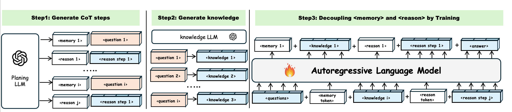

# Disentangling Memory and Reasoning in LLM


This is the official repository for the paper [Disentangling Memory and Reasoning Ability in Large Language Models](https://arxiv.org/abs/2411.13504). 

Arxiv Link: https://arxiv.org/abs/2411.13504

The existing LLM inference pipeline operates as an opaque process without explicit separation between knowledge retrieval and reasoning steps, making the model’s decision-making process unclear and disorganized. This ambiguity can lead to issues such as hallucinations and knowledge forgetting, significantly impacting LLMs' reliability in high-stakes domains. In this paper, we propose a new inference paradigm that decomposes the complex inference process into two distinct and clear actions: (1) memory recall: which retrieves relevant knowledge, and (2) reasoning: which performs logical steps based on the recalled knowledge. To facilitate this decomposition, we introduce two special tokens {memory}  and {reason}, guiding the model to distinguish between steps that require knowledge retrieval and those that involve reasoning.  Our experiment results show that this decomposition not only improves model performance but also enhances the interpretability of the inference process, enabling users to identify sources of error and refine model responses effectively. 
## Set up 

All data and models can be loaded from Huggingface. A Hugging Face Hub token is required. 

To set up the environment, run
```
pip install -r requirements.txt 
```

Check the load_data file and get the dataset you want
```
cd load_data/

python data_agent.py 
```
You can check the readme.md in load_data file

## Training

The `train.sh` script can be used for (parameter efficient) fine-tuning a pre-trained language model with CoT data. The accuracy evaluation has been built in the training loop. If performing parameter efficient fine-tuning, only the adapters and the newly added token embeddings will be saved in the checkpoint in `./checkpoints`.

Key arguments:

* `--dataset`: you can choose {'stratgeqa_agent', 'commonsenseqa_agent', 'truthfulqa_agent'}

* `--model_name_or_path`: Base model name/path.

* `--add_soft_prompts`: A binary argument determining whether to use planning tokens or not.

* `--parameter_efficient_mode`: Whether to perform parameter efficient fine-tuning. `none` means full fine-tuning. `lora` means LORA fine-tuning. `prompt-tuning` means tuning the embeddings of newly added tokens. To use planning tokens with LORA fine-tuning, this argument needs to be set as `lora+prompt-tuning`. The parameter efficient fine-tuning alghorithms are implemented based on the [PEFT](https://github.com/huggingface/peft) library. 

* `--num_general_prefix_tokens`: *n_prefix* in the paper.

* `--num_special_prefix_tokens`: *n_special* in the paper.

* `--extract_step_type_tokens`: same as `--selection_method` in `step_type.sh`.

* `--num_plan_types`: use memory.

* `--num_train_epochs`: 10 epochs are suitable for StratgyQA, 5 is suitable for CommonsenseQA, 15 is suitable for TruthfulQA

* `--num_test`: The maximum number of testing examples to be evaluated at the end of each epoch. We set this to 1000.

* `--int8_training`: Turn on this flag to save more GPU memories. Might impact the model performance.

### For Train LLAMA2-7B in the StrategyQA dataset: you can follow this setting to get the reported score:
```
DATASET=stratgeqa_agent\
MODE=supervised\
MODEL=meta-llama/Llama-2-7b-chat-hf\
ADD_SOFT_PROMPT=True\
N_PREFIX=2\
N_SPECIAL=4\
EFFICIENT=lora+prompt-tuning\
STEP_TYPE=memory\
LR=2e-4\
CUDA_VISIBLE_DEVICES=1 python train.py \
    --model_name_or_path $MODEL \
    --add_soft_prompts $ADD_SOFT_PROMPT \
    --hf_hub_token 'your token'\
    --num_general_prefix_tokens $N_PREFIX \
    --num_special_prefix_tokens $N_SPECIAL \
    --parameter_efficient_mode $EFFICIENT \
    --dataset $DATASET \
    --load_in_16fp False \
    --output_dir ./checkpoints/$MODEL/$DATASET/step_type=$STEP_TYPE-$N_PREFIX-$N_SPECIAL-efficient=$EFFICIENT-lr=$LR-soft-prompt=$ADD_SOFT_PROMPT \
    --model_max_length 700 \
    --num_train_epochs 10 \
    --per_device_train_batch_size 1 \
    --per_device_eval_batch_size 1 \
    --evaluation_strategy "epoch" \
    --save_strategy "epoch" \
    --save_total_limit 200 \
    --learning_rate $LR \
    --weight_decay 0. \
    --warmup_steps 700 \
    --lr_scheduler_type "cosine" \
    --logging_steps 1 \
    --optim "adamw_torch" \
    --gradient_accumulation_steps 16 \
    --embedding_model_name $MODEL \
    --extract_step_type_tokens $STEP_TYPE \
    --num_plan_types 5 \
    --num_test 200 \
    --lora_module mlp \
    --int8_training True \
```
### For Train LLAMA3-8B in the TruthfulQA dataset: you can follow this setting to get the reported score:
```
DATASET=truthfulqa_agent\
MODE=supervised\
MODEL=meta-llama/Llama-3.1-8B-Instruct\
ADD_SOFT_PROMPT=True\
N_PREFIX=3\
N_SPECIAL=4\
EFFICIENT=lora+prompt-tuning\
STEP_TYPE=memory\
LR=2e-4\
CUDA_VISIBLE_DEVICES=2 python train.py \
    --model_name_or_path $MODEL \
    --add_soft_prompts $ADD_SOFT_PROMPT\
    --num_general_prefix_tokens $N_PREFIX \
    --num_special_prefix_tokens $N_SPECIAL \
    --parameter_efficient_mode $EFFICIENT \
    --dataset $DATASET \
    --fp16 True \
    --output_dir ./checkpoints/$MODEL/$DATASET/step_type=$STEP_TYPE-$N_PREFIX-$N_SPECIAL-efficient=$EFFICIENT-lr=$LR-soft-prompt=$ADD_SOFT_PROMPT\
    --model_max_length 850 \
    --num_train_epochs 15\
    --per_device_train_batch_size 1 \
    --per_device_eval_batch_size 1 \
    --evaluation_strategy "epoch" \
    --save_strategy "epoch" \
    --save_total_limit 200 \
    --learning_rate $LR \
    --weight_decay 0. \
    --warmup_steps 1000 \
    --lr_scheduler_type "cosine" \
    --logging_steps 1 \
    --optim "adamw_torch" \
    --gradient_accumulation_steps 16 \
    --embedding_model_name $MODEL \
    --extract_step_type_tokens $STEP_TYPE \
    --num_plan_types 5 \
    --num_test 200\
    --lora_module mlp \
    --int8_training True \
```
## Evaluation

In the paper, we report the epoch producing the highest eval accuracy. The accuracy evaluation has been built in the training loop, and can be checked in the `trainer_state.json` file saved in the checkpoints as `eval_acc`.

To do evaluation sparately and save the generation results, use the script `eval.sh`. Need to make sure all the corresponding arguments are the same as the the training arguments in `train.sh`. The model generation results will be saved in the same directory as the loaded checkpoint. The saving format would be question - empty line - generated solution - empty line - ground truth solution.

Key arguments:

* `--model_name_or_path`: Checkpoint path. 

* `--base_model_name_or_path`: Base model for paramter efficient fine-tuning checkpoints. Must be the same as the `--model_name_or_path` in `train.sh` to correctly load the checkpoints.

* Please follow `train.sh` for other arguments.

### To evaluate LLAMA2-7B in the StrategyQA dataset: you can follow this setting to get the reported score(0.706):
```
DATASET=stratgeqa_agent\
MODEL=meta-llama/Llama-2-7b-chat-hf\
ADD_SOFT_PROMPT=True\
EFFICIENT=lora+prompt-tuning\
STEP_TYPE=memory\
CUDA_VISIBLE_DEVICES=0 python eval.py \
    --base_model_name_or_path $MODEL \
    --hf_hub_token ....... \
    --model_name_or_path ./checkpoints/meta-llama/Llama-2-7b-chat-hf/stratgeqa_agent/step_type=memory-2-4-efficient=lora+prompt-tuning-lr=2e-4-soft-prompt=True/checkpoint-801\
    --add_soft_prompts $ADD_SOFT_PROMPT\
    --parameter_efficient_mode $EFFICIENT \
    --dataset $DATASET \
    --batch_size 1 \
    --max_length 700 \
    --seed 300 \
    --extract_step_type_tokens $STEP_TYPE \
    --embedding_model_name $MODEL \
    --num_plan_types 5 \
    --num_test 1000 \
    --load_in_8bit True \
```
### Attention heatmap generation:
Use analysis.ipynb to generate an attention map.


